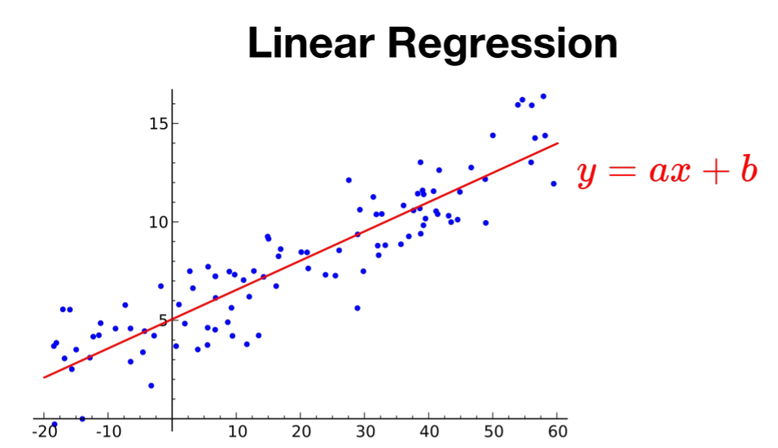
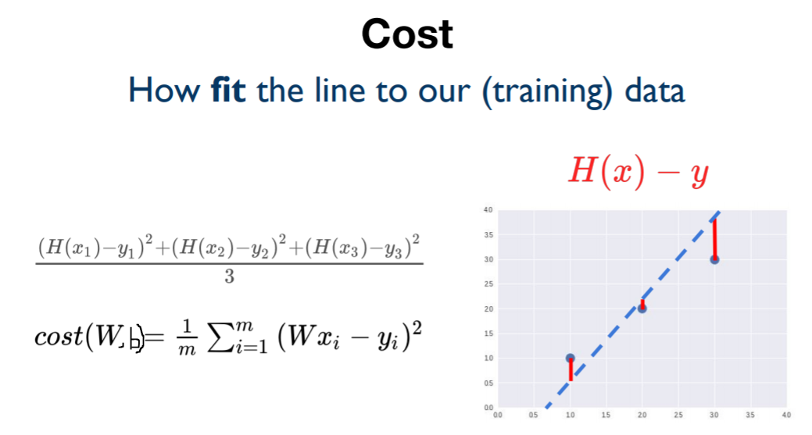

# Regression

## Regression towawrd the mean

- 어떤 데이터가 매우 작거나 큰 데이터가 나와도 전체적으로 보면 데이터들은 전체평균으로 되돌아가려는 속성이 있다.

## Linear Regression

- 데이터를 가장 잘 대변하는 직선의 방정식을 찾는 것
  

- Hyposis: H(x) = Wx + b
  - W: weight
  - b: bias
- 목표는 Cost가 최소인 직선 구하기!!
  
