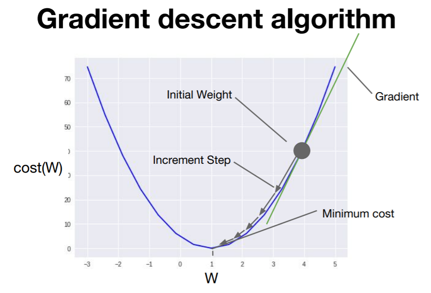
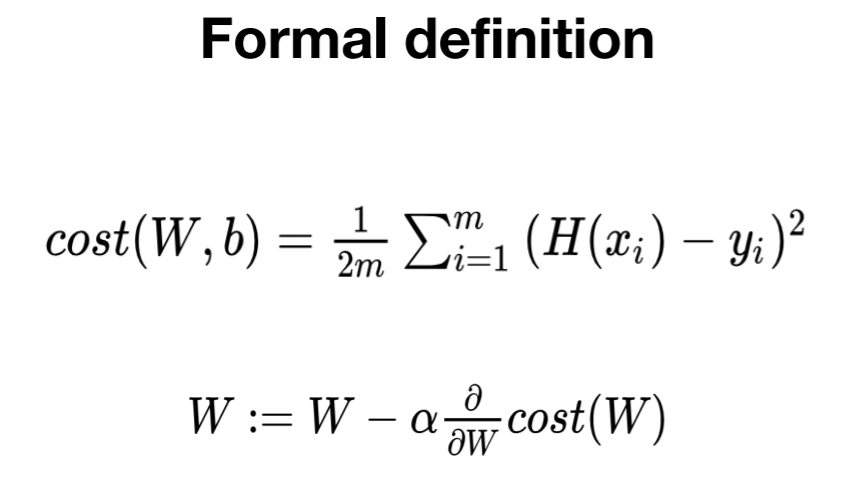
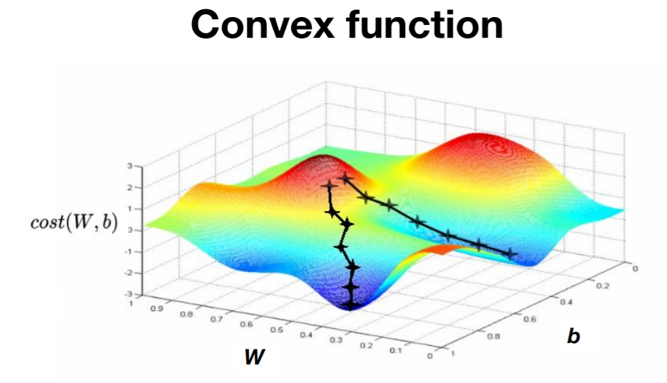
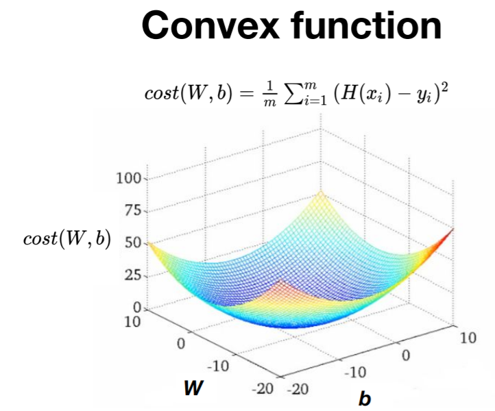

# Regression

## Regression towawrd the mean

- 어떤 데이터가 매우 작거나 큰 데이터가 나와도 전체적으로 보면 데이터들은 전체평균으로 되돌아가려는 속성이 있다.

## Linear Regression

- 데이터를 가장 잘 대변하는 직선의 방정식을 찾는 것
  

- Hyposis: H(x) = Wx + b
  - W: weight
  - b: bias
- 목표는 Cost가 최소인 직선 구하기!!
  

## Cost를 minimize하는 방법

### Gradient descent algorithm

- Gradient는 경사, descent는 하강 -> 경사하강
- 경사를 따라 내려가면서 최저점을 찾도록 하는 것
- 변수가 2개 뿐 아니라 여러개일 때도 사용가능
- How it works?
  - 최초의 추정을 통해 W와 b값을 정함
    - 0,0이나 랜덤값을 가지게 함
    - W, b값이 계속 줄어들도록 함
  - W, b값이 계속 업데이트 될 때 그 기울기를 구해서 cost가 최소화되는 방향으로 업데이트
  - 최소점에 도달했다고 판단될 때까지 반복
- 예제
  
  - W = 1일 때 cost가 최소
  - 경사가 클수록 많이 이동하고 경사가 작을수록 조금씩 이동함
  - W값을 아무곳에서 시작해도 같은 결과가 나옴
- Gradient(cost함수의 기울기)를 구하는 법
  

  - W로 편미분
  - α는 learning rate: gradient를 얼마나 반영할 것인지
  - learning rate가 크면 W값이 크게 움직이고 작으면 작게 움직임 -> 적절하게 설정해줘야 함

- Non-Convex function
  

  - 어디서 시작하는지에 따라 전체에서 최저점을 찾지 못할 수도 있음
  - local minimum: 주변에 비해 가장 낮은 지점
  - global minimum: 전체적으로 가장 낮은 지점
  - local minimum이 여러개 존재할 때
  - local minimum과 global minimum이 다를 때

- Convex function
  
  - 어디서 시작하든 global minimum을 찾을 수 있음
  - local minimum이 한개일 때
  - local minimum과 global minimum이 같을 때
  - 마음놓고 gradient descent 사용 가능
